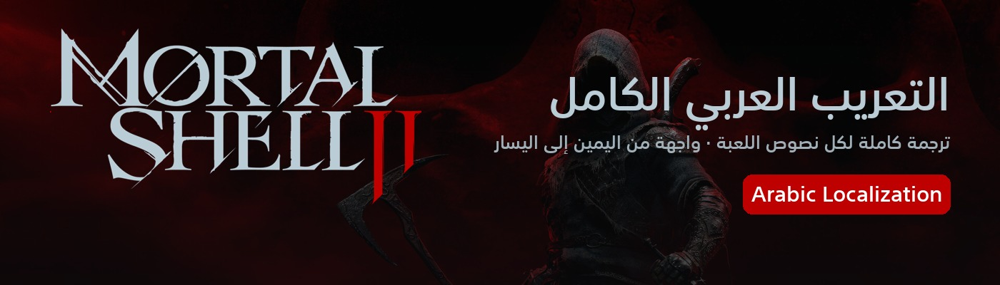
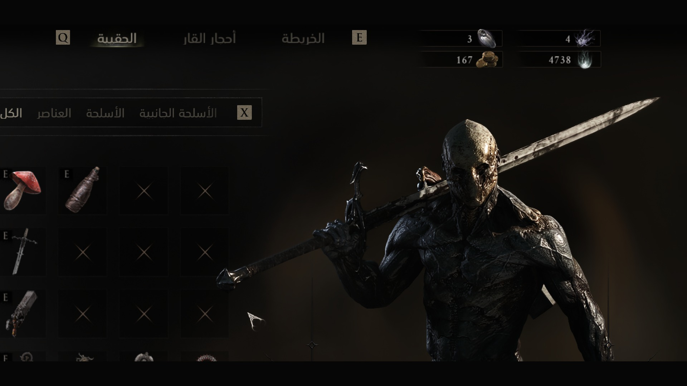
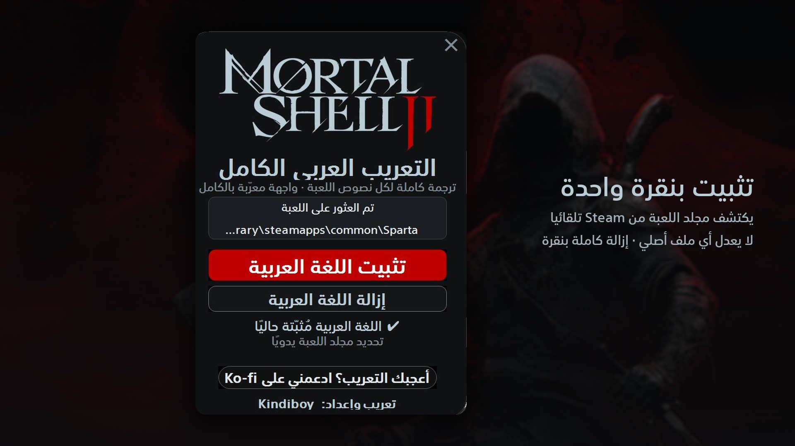

<h1 align="center">Mortal Shell II — التعريب الكامل</h1>

Complete Arabic localization for <b>Mortal Shell II</b> (Steam) · تعريب كامل للعبة

  <a href="https://github.com/faisalkindi/MortalShell2-Arabic/releases/latest/download/MortalShell2_Arabic_Installer.zip"><b>⬇ تحميل المثبّت / Download installer</b></a>
  &nbsp;·&nbsp;
  <a href="https://github.com/faisalkindi/MortalShell2-Arabic/releases/latest/download/MortalShell2_Arabic_Manual.zip">ملفات التثبيت اليدوي / Manual files</a>
  &nbsp;·&nbsp;
  <a href="https://github.com/faisalkindi/MortalShell2-Arabic/releases">كل الإصدارات / All releases</a>
  &nbsp;·&nbsp;
  <a href="https://ko-fi.com/kindiboy">☕ Ko-fi</a>

---

## العربية

**ماذا يعرّب؟** كل نصوص اللعبة (9,751 سطرًا): القوائم، الحوارات، أوصاف الأسلحة والقدرات، الدروس التعليمية، والقصة.

**المميزات**
- تُضاف العربية كلغة رسمية داخل إعدادات اللعبة (اللغة رقم 16) — لا تستبدل أي لغة أخرى.
- خط عربي واضح ومناسب لطابع اللعبة، مع إصلاح قصّ الحروف النازلة.
- واجهة معكوسة من اليمين إلى اليسار في القوائم والمخزون، مع بقاء أزرار التبويب (RB/LB، Z/X) في اتجاهها الطبيعي.
- اختيارك للغة يُحفظ ولا يعود إلى الإنجليزية عند كل تشغيل.
- مصطلحات موحّدة عبر اللعبة كلها (مسرد يضم 200+ مصطلح) ومراجعة لغوية مزدوجة.
- لا يعدّل أي ملف أصلي من ملفات اللعبة. الإزالة بنقرة واحدة.

**التثبيت (المثبّت)**
1. أغلق اللعبة.
2. حمّل `MortalShell2_Arabic_Installer.zip` من الرابط أعلاه وفكّ الضغط.
3. شغّل `Mortal Shell II Arabic Installer.exe` — يكتشف مجلد اللعبة تلقائيًا من Steam (أو حدّده يدويًا) — ثم اضغط «تثبيت اللغة العربية».
4. داخل اللعبة: الإعدادات ← اللعبة ← اللغة ← «العربية».

**التثبيت اليدوي**: فكّ `MortalShell2_Arabic_Manual.zip` وانسخ الملفات الستة (`pakchunk9998-Windows_P.*` و`zzz_ArabicLang_P.*`) إلى `<مجلد اللعبة>\MortalShell2\Content\Paks\`.

**الإزالة**: المثبّت ← «إزالة اللغة العربية»، أو احذف الملفات الستة نفسها.

## English

**What it covers.** Every line in the game (9,751 strings): menus, dialogue, weapon and ability descriptions, tutorials, and story.

**Features**
- Arabic is added as a real 16th language in the in-game settings — no other language is replaced.
- Custom Arabic font tuned for the game's look, with descender clipping fixed.
- Right-to-left mirrored layout in menus and inventory; tab controls (RB/LB, Z/X) keep their natural direction.
- Your language choice persists across launches.
- Consistent terminology across the whole game (200+ term glossary) with two-model linguistic review.
- No original game file is modified. One-click uninstall.

**Install (installer)**
1. Close the game.
2. Download `MortalShell2_Arabic_Installer.zip` above and unzip it.
3. Run `Mortal Shell II Arabic Installer.exe`; it auto-detects the Steam install (or pick the folder manually), then click the red install button.
4. In game: Settings → Game → Language → «العربية».

**Manual install**: unzip `MortalShell2_Arabic_Manual.zip` and copy the six files (`pakchunk9998-Windows_P.*` and `zzz_ArabicLang_P.*`) into `<game folder>\MortalShell2\Content\Paks\`.

**Uninstall**: installer → the outlined uninstall button, or delete those six files.

## Screenshots

| | |
|---|---|
|  |  |

## Notes

- Steam version. Other mods that replace the same UI widgets (main menu, options, character/inventory screens) may conflict.
- Steam's "Verify integrity of game files" does not remove the mod (extra files, none replaced).
- Font: SST Arabic (Samsung), used for non-commercial purposes only.
- Report any typo, clipped label or mistranslation in [Issues](https://github.com/faisalkindi/MortalShell2-Arabic/issues) — every report is folded into the next version.
- Contributors: see [`PIPELINE.md`](PIPELINE.md) for how the corpus, glossary, fonts and installer are built.

تعريب وإعداد: <b>Kindiboy</b>

